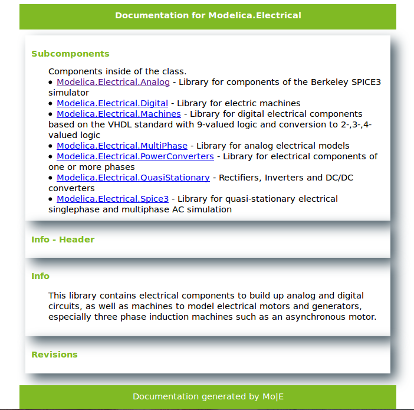
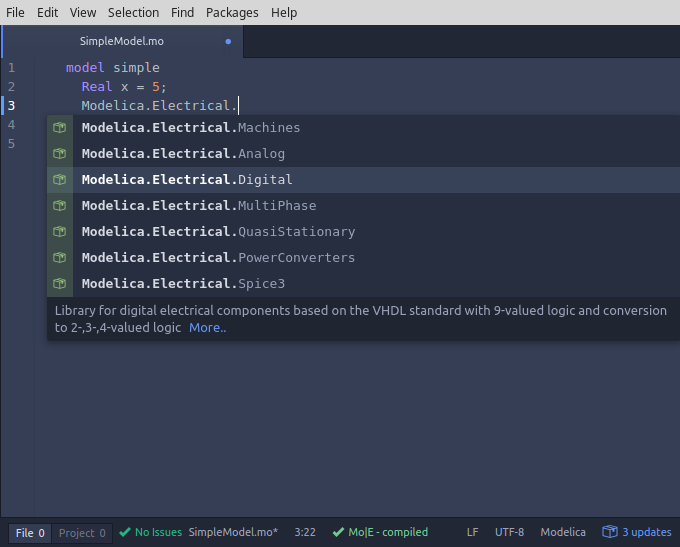

# Feature Overview
Mo|E turns **Editors** with supported Plugins into real **Modelica IDEs**.

## Features
- Error highlighting inside the editor,
	either on demand or after saving a file  
- Error reports for Modelica Scripts
- Go to definition using `Ctrl + Click`
- Open up documentation in external Browser

	

- Type completions via `Ctrl + Space`

	

- Support for different Compilers:
	- OpenModelica (beta)
	- JModelica (experimental)

## Supported Editors
- [Atom](www.atom.io)
- more coming soon
